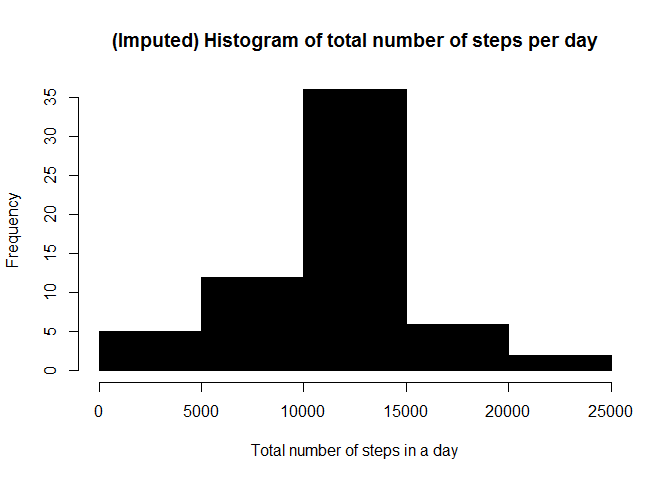
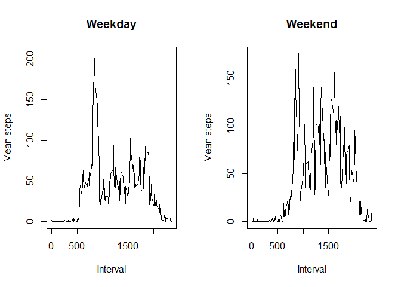

# Reproducible Research: Peer Assessment 1


## Loading and preprocessing the data

### Librarys

```r
library(data.table)
```

```
## Warning: package 'data.table' was built under R version 3.2.4
```

```r
library(dplyr)
```

```
## Warning: package 'dplyr' was built under R version 3.2.4
```

### Load data

```r
unzip("activity.zip")
data <- read.csv("activity.csv")
```

### Head

```r
head(data)
```

```
##   steps       date interval
## 1    NA 2012-10-01        0
## 2    NA 2012-10-01        5
## 3    NA 2012-10-01       10
## 4    NA 2012-10-01       15
## 5    NA 2012-10-01       20
## 6    NA 2012-10-01       25
```


## What is mean total number of steps taken per day?

### Plot the histogram

```r
dataRmNA <- tbl_df(data) %>% filter(!is.na(steps)) %>% group_by(date) %>% summarise(Sum = sum(steps))

hist(dataRmNA$Sum,
     col=1, main="Histogram of total number of steps per day", xlab="Total number of steps in a day")
```

<!-- -->

### Mean

```r
mean(dataRmNA$Sum)
```

```
## [1] 10766.19
```

### Median

```r
median(dataRmNA$Sum)
```

```
## [1] 10765
```
#### The mean is 10766.19 and the median is 10765

## What is the average daily activity pattern?

### Group by intenval and get mean from steps

```r
intervalRmNA <- tbl_df(data) %>% filter(!is.na(steps)) %>% group_by(interval) %>% summarise(Mean = mean(steps))
```
### Plot result

```r
plot(intervalRmNA$interval, intervalRmNA$Mean, type='l', col=1, 
     main="Average number of steps averaged over all days", xlab="Interval", 
     ylab="Average number of steps")
```

<!-- -->

```r
maxInterval <- tbl_df(intervalRmNA) %>% filter(Mean == max(Mean))
```
#### The max mean steps is 206.1698 in interval 835

## Imputing missing values

```r
naRows <- tbl_df(data) %>% filter(is.na(steps))
```
### Get number of na rows

```r
nrow(naRows)
```

```
## [1] 2304
```
#### The Data set has 2304 na rows.

```r
fillNa <- data
for (i in 1:nrow(fillNa)){
  if (is.na(fillNa$steps[i])){
    interval_val <- fillNa$interval[i]
    row_id <- which(intervalRmNA$interval == interval_val)
    steps_val <- intervalRmNA$Mean[row_id]
    fillNa$steps[i] <- steps_val
  }
}
```
#### The na values are now equal to the mean of intervals.

```r
stepsFillNa <- tbl_df(fillNa) %>% group_by(date) %>% summarise(Sum = sum(steps))
hist(stepsFillNa$Sum, col=1, main="(Imputed) Histogram of total number of steps per day", xlab="Total number of steps in a day")
```

<!-- -->

#### The median and mean are 10766.19.

## Are there differences in activity patterns between weekdays and weekends?


```r
data$date <- as.Date(data$date, format = "%Y-%m-%d")
data$week <- weekdays(data$date)
entreSemana <- tbl_df(data) %>% filter((week != "sábado" | week != "domingo") & !is.na(steps)) %>% group_by(interval) %>% summarise(Mean = mean(steps))
finSemana <- tbl_df(data) %>% filter((week == "sábado" | week == "domingo") & !is.na(steps)) %>% group_by(interval) %>% summarise(Mean = mean(steps))

par(mfrow=c(1,2))
plot(entreSemana$interval, entreSemana$Mean, type='l', col=1, 
     main="Weekday", xlab="Interval", 
     ylab="Mean steps")
plot(finSemana$interval, finSemana$Mean, type='l', col=1, 
     main="Weekend", xlab="Interval", 
     ylab="Mean steps")
```

<!-- -->
